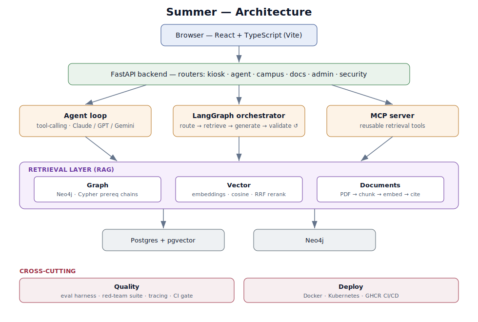

# Summer — Architecture

Summer is a production-shaped **Generative AI assistant** built end to end: a grounded,
multi-retriever RAG system with an agentic layer, wrapped in the engineering you need to
*operate* it — evaluation, safety testing, observability, and containerized deployment.
This document is the technical overview (and doubles as a portfolio write-up).

## What it does

It answers questions over a department's real data — courses, professors, advisors,
rooms, prerequisites, policies — through two surfaces:

- **Public hallway kiosk** — no login, voice in/out, multilingual. Locked to read-only
  campus tools; it physically cannot reach email, the filesystem, or any data-editing
  action. This is the most-used and most-restricted surface.
- **Authenticated admin platform** — staff log in to manage data, upload documents,
  run imports, and administer access, behind role-based auth + multi-factor security.

## System map



<details><summary>Text version of the diagram</summary>

```
                         Browser (React + TypeScript / Vite)
                          │           │
                 kiosk Q&A│           │authenticated dashboard
                          ▼           ▼
                     ┌─────────────────────────┐
                     │   FastAPI backend (API)  │
                     │  routers: kiosk, agent,  │
                     │  campus, docs, admin, …  │
                     └───────────┬─────────────┘
                                 │
              ┌──────────────────┼─────────────────────┐
              ▼                  ▼                      ▼
      ┌──────────────┐   ┌───────────────┐     ┌────────────────┐
      │  Agent loop  │   │ Orchestrator  │     │  MCP server    │
      │ (tool-calling│   │ (LangGraph:   │     │ (re-publishes  │
      │  Claude/GPT) │   │ route→retrieve│     │  retrieval as  │
      └──────┬───────┘   │ →gen→validate │     │  std MCP tools)│
             │           │  →iterate)    │     └────────────────┘
             │           └──────┬────────┘
             ▼                  ▼
      ┌─────────────────────────────────────────────┐
      │            Retrieval layer (3 ways)          │
      │  • Graph    → Neo4j (Cypher prerequisite     │
      │               traversals)                    │
      │  • Vector   → embeddings + cosine + RRF       │
      │               reranking (course catalog)     │
      │  • Documents→ PDF/text ingest → chunk → embed │
      │               → retrieve passages w/ citations│
      └───────────────────────┬─────────────────────┘
                              ▼
                  SQL (SQLite dev / Postgres+pgvector prod)
```

</details>

## Core components

| Area | File(s) | What it does |
|---|---|---|
| Agent loop | `app/agent.py` | Tool-calling loop (Claude or OpenAI), per-user memory, role-scoped tools; separate hardened `run_kiosk_agent` |
| Tools | `app/tools.py` | Role-gated tool registry the agent can call |
| Graph-RAG | `app/graph.py`, `app/graph_sync.py` | Builds a Neo4j course graph; Cypher traversals for full prerequisite chains / unlocks |
| Vector-RAG | `app/embeddings.py`, `app/vector_store.py` | Embeds courses; cosine search + **Reciprocal Rank Fusion** to blend keyword + semantic |
| Document-RAG | `app/docs_rag.py` | Ingest PDF/text → overlap chunking → embed → retrieve passages **with citations** |
| Orchestrator | `app/orchestrator.py` | **LangGraph** multi-agent graph: route → retrieve → generate → validate, with a grounding-driven retry cycle |
| MCP server | `app/mcp_server.py` | Re-publishes the read-only retrieval tools over the Model Context Protocol (reusable by any MCP client) |
| Security | `app/auth.py`, `app/security.py`, `app/approvals.py`, `app/audit.py` | RBAC, TOTP + WebAuthn MFA, maker-checker approval workflow, append-only audit log |

## Retrieval & grounding flow

1. A question hits the agent (or the orchestrator for the multi-step path).
2. It's **routed** to the right retriever — graph for "what's required before X," vector
   for topic search, documents for policy/how-to, schedule for direct lookups.
3. Retrieved context is passed to the model, which answers **only** from it.
4. The answer is **validated** for grounding; if weak, the query is broadened and retried.
5. If nothing grounds it, the assistant says so and points to a human — it never invents
   a room, time, or prerequisite.

## Quality engineering (the "operate it" half)

- **Eval harness** (`app/eval_harness.py`) — structural evals (no key: guardrails wired
  right) + behavioral evals (grade reply + tool trace: routing, refusal, grounding).
- **Red-team / safety suite** — adversarial cases (prompt injection, system-prompt
  exfiltration, jailbreaks, tool abuse, embedded-instruction attacks) asserting the
  assistant resists.
- **Tracing / observability** (`app/tracing.py`) — per-run spans: tools called, latency
  (p50/p95), token cost.
- **CI gate** (`.github/workflows/evals.yml`) — structural evals + all deterministic test
  suites run on every push; a regression that weakens a guardrail fails the build.

## Deployment

- **Docker** (`Dockerfile`, `frontend/Dockerfile`, `docker-compose.yml`) — one command
  brings up web + API + Postgres/pgvector + Neo4j.
- **Kubernetes** (`k8s/`) — Deployments with health probes, multi-replica stateless
  services, PVC-backed databases, ConfigMap/Secret split, Ingress.
- **CD** (`.github/workflows/deploy.yml`) — builds + pushes both images to GHCR.

## Tech stack

| Layer | Tech |
|---|---|
| Frontend | React, TypeScript, Vite, shadcn/ui |
| Backend | Python, FastAPI, SQLAlchemy |
| AI | Claude API, OpenAI API, LangGraph, MCP, embeddings |
| Data | SQLite (dev) / Postgres + pgvector (prod), Neo4j |
| Quality | pytest, eval harness, red-team suite, tracing |
| Infra | Docker, Kubernetes, GitHub Actions (CI + CD) |
